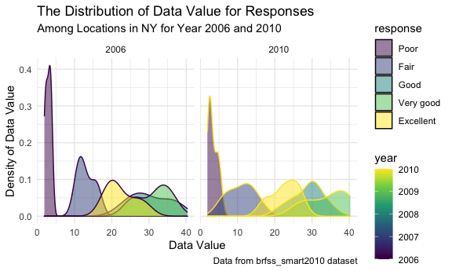

p8105\_hw3\_wq2161
================
Wanxin Qi
10/16/2021

## Problem 1

Load the *instacart* data from the *p8105.datasets*.

``` r
data("instacart")
instacart = instacart %>%
  janitor::clean_names()
```

-   Description of the *instacart* dataset

The instacart dataset includes information on some of the items ordered
from instacart online grocery website. It contains 15 variables which
are order\_id, product\_id, add\_to\_cart\_order, reordered, user\_id,
eval\_set, order\_number, order\_dow, order\_hour\_of\_day,
days\_since\_prior\_order, product\_name, aisle\_id, department\_id,
aisle, department. Specifically, order\_dow is the day of the week on
which the order was placed, and order\_hour\_of\_day is the hour of the
day on which the order was placed. There are 1384617 items where each
row of the dataset is an ordered item.

For example, the first item was ordered by the user with user id 112108,
and the order id is 1. It is a Bulgarian Yogurt with product id 49302,
which belongs to yogurt aisle with aisle id 120 and the department of
dairy eggs with department id 16. The order in which this item was added
to cart was 1, and this product has been ordered by this user in the
past since reorder has value of 1. This order is the 4 order for this
user. It was placed on the 10 hour of the day and the 4 day of the week.
The days since the last order for the user is 9. It belongs to the
“train” evaluation set.

-   How many aisles are there, and which aisles are the most items
    ordered from?

``` r
aisle_num = instacart %>%
  group_by(aisle) %>%
  summarize(n_aisle = n())
aisle_num
```

    ## # A tibble: 134 × 2
    ##    aisle                  n_aisle
    ##    <chr>                    <int>
    ##  1 air fresheners candles    1067
    ##  2 asian foods               7007
    ##  3 baby accessories           306
    ##  4 baby bath body care        328
    ##  5 baby food formula        13198
    ##  6 bakery desserts           1501
    ##  7 baking ingredients       13088
    ##  8 baking supplies decor     1094
    ##  9 beauty                     287
    ## 10 beers coolers             1839
    ## # … with 124 more rows

``` r
most_items = aisle_num %>%
  mutate(aisle_rank = min_rank(desc(n_aisle))) %>%
  filter(aisle_rank == 1)
most_items
```

    ## # A tibble: 1 × 3
    ##   aisle            n_aisle aisle_rank
    ##   <chr>              <int>      <int>
    ## 1 fresh vegetables  150609          1

There are 134 aisles. The aisle that the most items ordered from is
fresh vegetables.

-   Make a plot that shows the number of items ordered in each aisle,
    limiting this to aisles with more than 10000 items ordered. Arrange
    aisles sensibly, and organize your plot so others can read it.

``` r
aisle_num %>%
  filter(n_aisle > 10000) %>%
  mutate(aisle = fct_reorder(aisle, n_aisle)) %>%
  ggplot(aes(x = n_aisle, y = aisle)) +
  geom_point(alpha = .5) +
  labs(
    title = "The Number of Items Ordered in Each Aisle",
    subtitle = "Aisles with more than 10,000 items ordered",
    x = "Number of Items Ordered",
    y = "Aisle",
    caption = "Data from instacart"
  ) +
  theme_minimal() +
  scale_x_continuous(
    breaks = c(20000, 40000, 60000, 80000, 100000, 120000, 140000),
    labels = c("20k", "40k", "60k", "80k", "100k", "120k", "140k")
  )
```


The plot shows that the number of items ordered in fresh vegetables and
fresh fruits are much more than other aisles. Most of the aisles have
number of items ordered under 40,000.

-   Make a table showing the three most popular items in each of the
    aisles “baking ingredients”, “dog food care”, and “packaged
    vegetables fruits”. Include the number of times each item is ordered
    in your table.

``` r
product_num = instacart %>%
  filter(aisle %in% c("baking ingredients", "dog food care", "packaged vegetables fruits")) %>%
  group_by(aisle, product_name) %>%
  summarize(n_product = n()) %>%
  mutate(product_rank = min_rank(desc(n_product))) %>%
  filter(product_rank <= 3) %>%
  arrange(aisle, product_rank)

product_num %>%
  knitr::kable()
```

| aisle                      | product\_name                                 | n\_product | product\_rank |
|:---------------------------|:----------------------------------------------|-----------:|--------------:|
| baking ingredients         | Light Brown Sugar                             |        499 |             1 |
| baking ingredients         | Pure Baking Soda                              |        387 |             2 |
| baking ingredients         | Cane Sugar                                    |        336 |             3 |
| dog food care              | Snack Sticks Chicken & Rice Recipe Dog Treats |         30 |             1 |
| dog food care              | Organix Chicken & Brown Rice Recipe           |         28 |             2 |
| dog food care              | Small Dog Biscuits                            |         26 |             3 |
| packaged vegetables fruits | Organic Baby Spinach                          |       9784 |             1 |
| packaged vegetables fruits | Organic Raspberries                           |       5546 |             2 |
| packaged vegetables fruits | Organic Blueberries                           |       4966 |             3 |

Based on the table, although these products are the three most popular
items of their aisles, the number they were ordered are different. The
number of products purchased in baking ingredients is in hundreds, the
number of products purchased in dog food care is in tens, and the number
of products purchased in packaged vegetables fruits is in thousands. It
is obvious that people all need vegetables and fruits for living.

-   Make a table showing the mean hour of the day at which Pink Lady
    Apples and Coffee Ice Cream are ordered on each day of the week;
    format this table for human readers (i.e. produce a 2 x 7 table).

``` r
mean_hour = instacart %>%
  filter(product_name %in% c("Pink Lady Apples", "Coffee Ice Cream")) %>%
  group_by(product_name, order_dow) %>%
  summarize(
    mean = mean(order_hour_of_day)
  ) %>%
  pivot_wider(
    names_from = order_dow,
    values_from = mean,
  )

mean_hour %>% knitr::kable(digit = 2)
```

| product\_name    |     0 |     1 |     2 |     3 |     4 |     5 |     6 |
|:-----------------|------:|------:|------:|------:|------:|------:|------:|
| Coffee Ice Cream | 13.77 | 14.32 | 15.38 | 15.32 | 15.22 | 12.26 | 13.83 |
| Pink Lady Apples | 13.44 | 11.36 | 11.70 | 14.25 | 11.55 | 12.78 | 11.94 |

The table shows the mean hour of the day at which Coffee Ice Cream, Pink
Lady Apples are ordered on each day of the week. There are 7 days in a
week range from 0 to 6. The mean hour of the day are all after 10 hours
before 16 hours, indicating that the average time for people to shop is
around afternoon.

## Problem 2

Load the *BRFSS* data from the *p8105.datasets* and clean.

``` r
data("brfss_smart2010")

brfss = brfss_smart2010 %>%
  janitor::clean_names() %>%
  rename(
    state = locationabbr,
    location = locationdesc,
  ) %>%
  filter(
    topic == "Overall Health",
    response %in% c("Poor", "Fair", "Good", "Very good", "Excellent")
    ) %>%
  mutate(
    response = factor(response, levels = c("Poor", "Fair", "Good", "Very good", "Excellent"))
  )
brfss
```

    ## # A tibble: 10,625 × 23
    ##     year state location   class  topic question  response sample_size data_value
    ##    <int> <chr> <chr>      <chr>  <chr> <chr>     <fct>          <int>      <dbl>
    ##  1  2010 AL    AL - Jeff… Healt… Over… How is y… Excelle…          94       18.9
    ##  2  2010 AL    AL - Jeff… Healt… Over… How is y… Very go…         148       30  
    ##  3  2010 AL    AL - Jeff… Healt… Over… How is y… Good             208       33.1
    ##  4  2010 AL    AL - Jeff… Healt… Over… How is y… Fair             107       12.5
    ##  5  2010 AL    AL - Jeff… Healt… Over… How is y… Poor              45        5.5
    ##  6  2010 AL    AL - Mobi… Healt… Over… How is y… Excelle…          91       15.6
    ##  7  2010 AL    AL - Mobi… Healt… Over… How is y… Very go…         177       31.3
    ##  8  2010 AL    AL - Mobi… Healt… Over… How is y… Good             224       31.2
    ##  9  2010 AL    AL - Mobi… Healt… Over… How is y… Fair             120       15.5
    ## 10  2010 AL    AL - Mobi… Healt… Over… How is y… Poor              66        6.4
    ## # … with 10,615 more rows, and 14 more variables: confidence_limit_low <dbl>,
    ## #   confidence_limit_high <dbl>, display_order <int>, data_value_unit <chr>,
    ## #   data_value_type <chr>, data_value_footnote_symbol <chr>,
    ## #   data_value_footnote <chr>, data_source <chr>, class_id <chr>,
    ## #   topic_id <chr>, location_id <chr>, question_id <chr>, respid <chr>,
    ## #   geo_location <chr>

-   In 2002, which states were observed at 7 or more locations? What
    about in 2010?

``` r
state_2002 = brfss %>%
  filter(year == 2002) %>%
  group_by(state) %>%
  summarize(n_location = n_distinct(location)) %>%
  filter(n_location >= 7)
state_2002
```

    ## # A tibble: 6 × 2
    ##   state n_location
    ##   <chr>      <int>
    ## 1 CT             7
    ## 2 FL             7
    ## 3 MA             8
    ## 4 NC             7
    ## 5 NJ             8
    ## 6 PA            10

``` r
state_2010 = brfss %>%
  filter(year == 2010) %>%
  group_by(state) %>%
  summarize(n_location = n_distinct(location)) %>%
  filter(n_location >= 7)
state_2010
```

    ## # A tibble: 14 × 2
    ##    state n_location
    ##    <chr>      <int>
    ##  1 CA            12
    ##  2 CO             7
    ##  3 FL            41
    ##  4 MA             9
    ##  5 MD            12
    ##  6 NC            12
    ##  7 NE            10
    ##  8 NJ            19
    ##  9 NY             9
    ## 10 OH             8
    ## 11 PA             7
    ## 12 SC             7
    ## 13 TX            16
    ## 14 WA            10

In 2002, there were 6 states which were observed at 7 or more locations.
In 2010, there were 14 states which were observed at 7 or more
locations.

-   Construct a dataset that is limited to Excellent responses, and
    contains, year, state, and a variable that averages the data\_value
    across locations within a state. Make a “spaghetti” plot of this
    average value over time within a state (that is, make a plot showing
    a line for each state across years – the geom\_line geometry and
    group aesthetic will help).

``` r
excellent_df = brfss %>%
  filter(response == "Excellent") %>%
  group_by(year, state) %>%
  summarize(mean_data_value = mean(data_value))
excellent_df
```

    ## # A tibble: 443 × 3
    ## # Groups:   year [9]
    ##     year state mean_data_value
    ##    <int> <chr>           <dbl>
    ##  1  2002 AK               27.9
    ##  2  2002 AL               18.5
    ##  3  2002 AR               24.1
    ##  4  2002 AZ               24.1
    ##  5  2002 CA               22.7
    ##  6  2002 CO               23.1
    ##  7  2002 CT               29.1
    ##  8  2002 DC               29.3
    ##  9  2002 DE               20.9
    ## 10  2002 FL               25.7
    ## # … with 433 more rows

``` r
excellent_df %>%
  ggplot(aes(x = year, y = mean_data_value)) +
  geom_line(aes(group = state), alpha = .5) +
  labs(
    title = "Average Data Value vs. Year for Each State",
    subtitle = "Only for Excellent Responses",
    x = "Year",
    y = "Average Data Value",
    caption = "Data from brfss_smart2010 dataset"
  ) +
  theme_minimal()
```


Based on the plot, most of the average data value range from 15 to 30.
The general trend of the average data value for states is decreasing
with time. While there are some states whose average data value is
fluctuated up and down with time.

-   Make a two-panel plot showing, for the years 2006, and 2010,
    distribution of data\_value for responses (“Poor” to “Excellent”)
    among locations in NY State.

``` r
NY_df = brfss %>%
  filter(
    year %in% c(2006, 2010),
    state == "NY"
  ) %>%
  group_by(year,location, response) %>%
  summarize(data_value)
NY_df
```

    ## # A tibble: 75 × 4
    ## # Groups:   year, location [15]
    ##     year location           response  data_value
    ##    <int> <chr>              <fct>          <dbl>
    ##  1  2006 NY - Kings County  Poor             3.3
    ##  2  2006 NY - Kings County  Fair            15.3
    ##  3  2006 NY - Kings County  Good            36.3
    ##  4  2006 NY - Kings County  Very good       25.9
    ##  5  2006 NY - Kings County  Excellent       19.2
    ##  6  2006 NY - Nassau County Poor             3.5
    ##  7  2006 NY - Nassau County Fair            11.6
    ##  8  2006 NY - Nassau County Good            28.2
    ##  9  2006 NY - Nassau County Very good       35  
    ## 10  2006 NY - Nassau County Excellent       21.7
    ## # … with 65 more rows

``` r
NY_df %>%
  ggplot(aes(x = data_value, y = location, color = response)) +
  geom_point(alpha = 0.5) +
  facet_grid(. ~ year) +
  labs(
    title = "Locations vs. Data_Value",
    subtitle = "For Responses in NY in Year 2006 and 2010",
    x = "Response",
    y = "Data Value",
    caption = "Data from brfss_smart2010 dataset"
  ) +
  theme(legend.position = "bottom")
```



Comment

## Problem 3

-   Load, tidy, and otherwise wrangle the data. Your final dataset
    should include all originally observed variables and values; have
    useful variable names; include a weekday vs weekend variable; and
    encode data with reasonable variable classes. Describe the resulting
    dataset (e.g. what variables exist, how many observations, etc).

``` r
accel_data = read_csv("data/accel_data.csv")

accel_data = accel_data %>%
  janitor::clean_names() %>%
  mutate(day_end = ifelse(day %in% c("Saturday", "Sunday"), "weekend", "weekday")) %>%
  relocate(week, day_id, day, day_end) %>%
  pivot_longer(
    activity_1:activity_1440,
    names_to = "activity_count",
    values_to = "data_value"
  ) %>%
  mutate(
    week = as.numeric(week),
    day_id = as.numeric(day_id),
    day = as.character(day),
    day_end = as.character(day_end),
    activity_count = as.character(activity_count),
    data_value = as.numeric(data_value)
  )

accel_data
```

    ## # A tibble: 50,400 × 6
    ##     week day_id day    day_end activity_count data_value
    ##    <dbl>  <dbl> <chr>  <chr>   <chr>               <dbl>
    ##  1     1      1 Friday weekday activity_1           88.4
    ##  2     1      1 Friday weekday activity_2           82.2
    ##  3     1      1 Friday weekday activity_3           64.4
    ##  4     1      1 Friday weekday activity_4           70.0
    ##  5     1      1 Friday weekday activity_5           75.0
    ##  6     1      1 Friday weekday activity_6           66.3
    ##  7     1      1 Friday weekday activity_7           53.8
    ##  8     1      1 Friday weekday activity_8           47.8
    ##  9     1      1 Friday weekday activity_9           55.5
    ## 10     1      1 Friday weekday activity_10          43.0
    ## # … with 50,390 more rows

The dataset includes 6 variables, which are week, day\_id, day,
day\_end, activity\_count, data\_value, and 50400 observations.

-   Traditional analyses of accelerometer data focus on the total
    activity over the day. Using your tidied dataset, aggregate across
    minutes to create a total activity variable for each day, and create
    a table showing these totals. Are any trends apparent?

``` r
accel_total = accel_data %>%
  group_by(week, day_id, day, day_end) %>%
  summarize(total_activity = sum(data_value))

accel_total %>%
  knitr::kable()
```

| week | day\_id | day       | day\_end | total\_activity |
|-----:|--------:|:----------|:---------|----------------:|
|    1 |       1 | Friday    | weekday  |       480542.62 |
|    1 |       2 | Monday    | weekday  |        78828.07 |
|    1 |       3 | Saturday  | weekend  |       376254.00 |
|    1 |       4 | Sunday    | weekend  |       631105.00 |
|    1 |       5 | Thursday  | weekday  |       355923.64 |
|    1 |       6 | Tuesday   | weekday  |       307094.24 |
|    1 |       7 | Wednesday | weekday  |       340115.01 |
|    2 |       8 | Friday    | weekday  |       568839.00 |
|    2 |       9 | Monday    | weekday  |       295431.00 |
|    2 |      10 | Saturday  | weekend  |       607175.00 |
|    2 |      11 | Sunday    | weekend  |       422018.00 |
|    2 |      12 | Thursday  | weekday  |       474048.00 |
|    2 |      13 | Tuesday   | weekday  |       423245.00 |
|    2 |      14 | Wednesday | weekday  |       440962.00 |
|    3 |      15 | Friday    | weekday  |       467420.00 |
|    3 |      16 | Monday    | weekday  |       685910.00 |
|    3 |      17 | Saturday  | weekend  |       382928.00 |
|    3 |      18 | Sunday    | weekend  |       467052.00 |
|    3 |      19 | Thursday  | weekday  |       371230.00 |
|    3 |      20 | Tuesday   | weekday  |       381507.00 |
|    3 |      21 | Wednesday | weekday  |       468869.00 |
|    4 |      22 | Friday    | weekday  |       154049.00 |
|    4 |      23 | Monday    | weekday  |       409450.00 |
|    4 |      24 | Saturday  | weekend  |         1440.00 |
|    4 |      25 | Sunday    | weekend  |       260617.00 |
|    4 |      26 | Thursday  | weekday  |       340291.00 |
|    4 |      27 | Tuesday   | weekday  |       319568.00 |
|    4 |      28 | Wednesday | weekday  |       434460.00 |
|    5 |      29 | Friday    | weekday  |       620860.00 |
|    5 |      30 | Monday    | weekday  |       389080.00 |
|    5 |      31 | Saturday  | weekend  |         1440.00 |
|    5 |      32 | Sunday    | weekend  |       138421.00 |
|    5 |      33 | Thursday  | weekday  |       549658.00 |
|    5 |      34 | Tuesday   | weekday  |       367824.00 |
|    5 |      35 | Wednesday | weekday  |       445366.00 |

-   Accelerometer data allows the inspection activity over the course of
    the day. Make a single-panel plot that shows the 24-hour activity
    time courses for each day and use color to indicate day of the week.
    Describe in words any patterns or conclusions you can make based on
    this graph.

``` r
accel_plot_df = accel_data %>%
  mutate(
    day = factor(day, levels = c("Sunday", "Monday", "Tuesday", "Wednesday", "Thursday", "Friday", "Saturday"))
  )

accel_plot_df %>%
  ggplot(aes(x = day_id, y = data_value, color = day)) +
  geom_point(alpha = 0.5)
```


